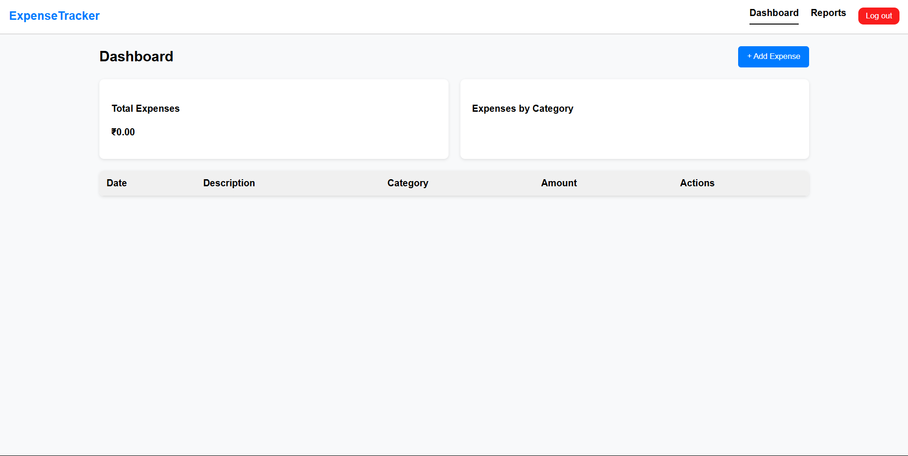
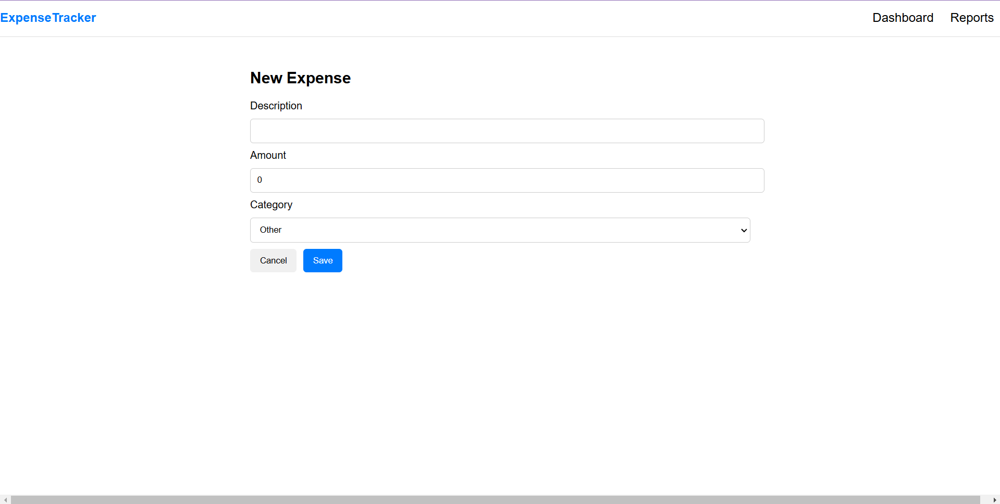

# 📊 Finance Manager

## About
"A finance management system to track expenses, analyze spending, and manage budgets efficiently."

# 📸 Screenshots
Here’s a preview of the application:

## 🚀 Features
- ✅ Authentication and Authorization
- ✅ Proper working of models
- ✅ Proper working of CRUD operations

## 🖥️ Tech Stack
- Backend: Node.js, Express, ejs pages
- Database: MongoDB

## 📝 You can reach me at:
- Email: adityapandey18501@gmail.com
- GitHub: [Aditya7pandey](https://github.com/Aditya7pandey)
- Twitter: [@Adi_insights](https://twitter.com/Adi_insights)
